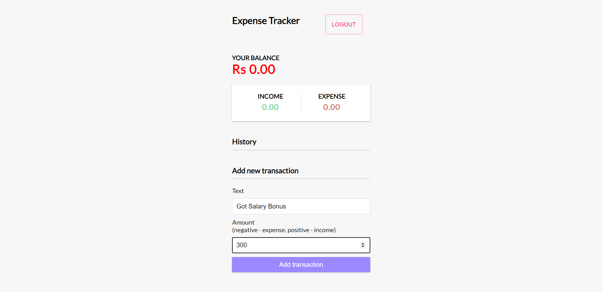

## `Income-Expense Tracker App`
**This app is built using React and Firebase database.
This app provides user-authentication as well as all CRUD operations related to Income/Expense.**

### `Clone the repository:` 
```
git clone 
https://github.com/AyushDubey-maker/expense-tracker-react.git
```
<details>
<summary>View Code Output :</summary>



</details>


