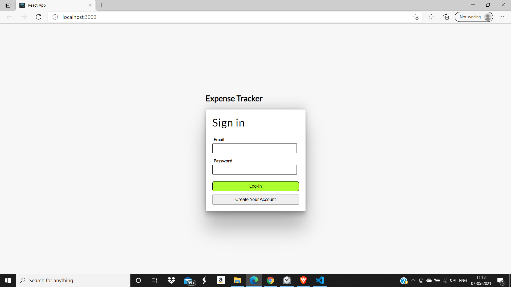
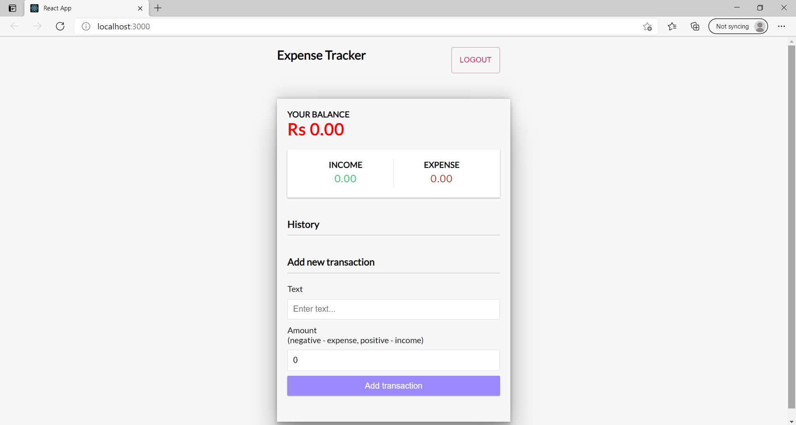
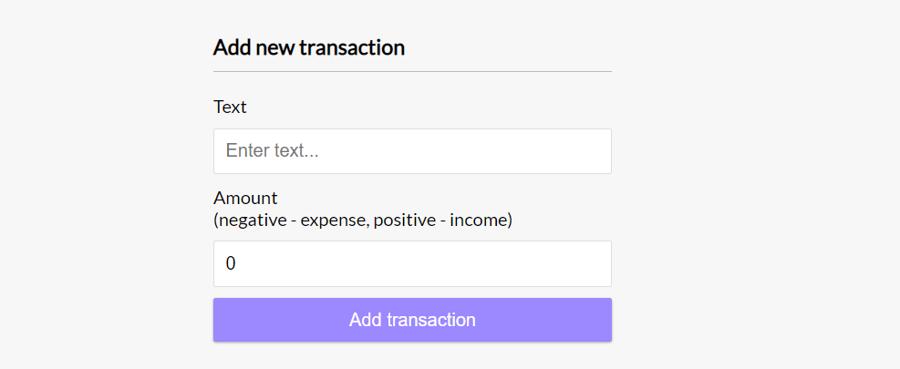
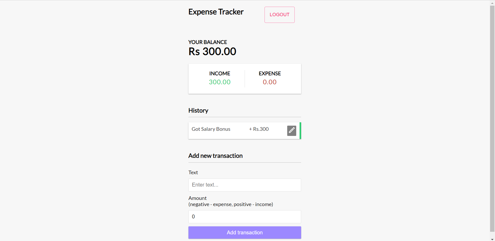
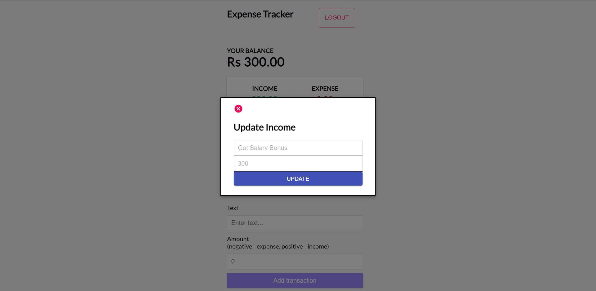

## `Income-Expense Tracker App`
**This app is built using React and Firebase database.
This app provides user-authentication as well as all CRUD operations related to Income/Expense.**

### `Clone the repository:` 
```
git clone 
https://github.com/AyushDubey-maker/expense-tracker-react.git`
```
### `Install Packages:`
```
npm install
```
```
@material-ui/core
@material-ui/icons
firebase
react-id-generator
react-router-dom
```
`Note:Do not forget to create your firebase Project and add the firebase config file in your code`


Get started with Firebase (Web): https://firebase.google.com/docs/web/setup

Firebase React Setup:
https://www.codementor.io/@yurio/all-you-need-is-react-firebase-4v7g9p4kf

Checkout firebase demo file for this app :  
https://github.com/AyushDubey-maker/expense-tracker-react/blob/master/expense-tracker/src/demo-firebase.js


<details>
<summary>View Code Output :</summary>

 > ### Login Page:


> ### Home-Page Outputs:
<hr/>


<hr/>


 > ### Update Transaction:
 <hr/>
 
</details>

### Features 📣:
- Create your account with complete user authentication.
- Add your income and expense accordingly which will be added to your balance.
- Income/ Expense can also be updated or deleted which will also be updated to the total balance.

- This will eventually help you to keep a track on your income.


